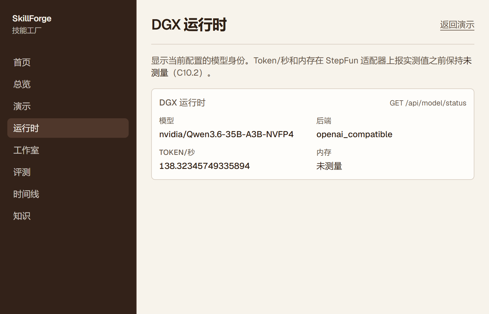
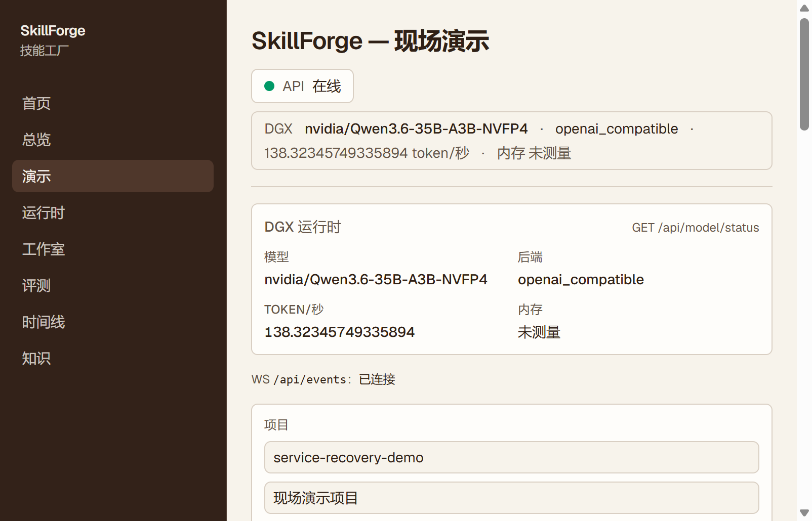

# SkillForge

企业真正缺的不是另一个 Chatbot，而是把人的操作知识可靠地变成 Agent 能执行的能力。SkillForge 把 SOP 编译成 Skill，并证明这个 Skill 真的让 Agent 更好。

```text
SOP
 ↓
Compile
 ↓
Skill
 ↓
Failure
 ↓
Evaluation
 ↓
Evolution
 ↓
Success
```

演示不要从「多智能体系统」讲起。要讲的是：同一模型、同一套工具、同一预算，只差系统提示里有没有这份 Skill。有 Skill 的一臂恢复得更多，这个差才算数。差是评测算出来的，不是模型自己说的。

## 业务：一次服务恢复在证明什么

场景是边缘服务挂了。ops-lab 里有 nginx、backend 和 mock-db。入口在宿主机 `8088`。健康检查应返回 HTTP 200。三种故障对应 Runbook 的不同段落，也对应 Skill 有没有把那段知识编译进去。

| 故障 | 现场发生了什么 | 手册里在哪 | v0.1 Skill | v0.2 Skill |
|---|---|---|---|---|
| F1 `backend_stopped` | backend 容器停了 | 主章节 Service Down | 会按步骤检查并重启 backend | 同样会 |
| F2 `nginx_wrong_upstream` | upstream 被改成 `backend:8081` | 主章节只说检查 upstream，不写端口对照，也不写 `nginx -t` | 把 upstream 改回 `server backend:8080;` | 同样会 |
| F3 `nginx_bad_config_reload` | 配置语法错误，并且 upstream 仍指向 `8081`，reload 会失败 | **只有** Appendix B：先 `nginx -t`，再对照 upstream 端口和 backend 实际监听端口 | 评测里有这条，正文没有 `nginx -t` | 补丁把 Appendix B 写进指令 |

v0.1 不是一份残缺到不能用的手册。它能处理 F1 和「只改端口」的 F2。F3 失败是因为编译 v0.1 时，Appendix B 的触发词对不上「service recovery」这个范围，知识在库里，没有进入 Skill。失败分析再用查询 `502 upstream nginx -t` 把它召回，补丁才把 `nginx -t` 写进去。这是可复现的进化，不靠模型碰巧想起来。

设计上的对照是：没有 Skill 时 F1 能过、F2 不稳定、F3 过不了；v0.1 稳定覆盖 F1 和 F2；v0.2 再盖住 F3。这是执行方案里的预期结构，不是现场临时改 expected 凑出来的分数。完整矩阵预先算好，现场只再跑一条 live。

每条可执行指令以 `ins_NN` 开头，并且在 `references/source-map.json` 里指向原文的文档哈希和行号或页码。没有出处的句子不能进候选版本。禁止项单独编号：不许删 volume、不许动 mock-db、不许 `sudo` / `mount` / `shutdown` / `rm -rf`。

## 十五步在系统里落在哪

| 步 | 业务上看到什么 | 系统实际做什么 |
|---|---|---|
| 1 | 上传 Runbook | 原文入库，记下 sha256。Markdown、PDF、OpenAPI 各有解析器 |
| 2 | 抽出知识单元 | 模型只填类型、标题、触发词和步骤。`source_ref` 由代码写上文档、块、页码或行号 |
| 3 | 生成 service-recovery Skill | Compiler 按触发词挑选知识单元，渲染 `SKILL.md` 和脚本。golden 是验收参照，不是事后改出来的答案 |
| 4 | 生成评测 | `evals/evals.json` 写 fixture、expected、forbidden。Patcher 对它只读 |
| 5 | 注入真实故障 | 只通过 ops-lab 的注入脚本，限定 compose 项目 |
| 6 | Agent 恢复 | ReAct 循环。有 Skill 时只在系统提示末尾追加 Skill 正文 |
| 7 | Verifier 判定 | 独立脚本看 HTTP、容器是否在跑等字段，不看模型的自我评价 |
| 8–10 | v0.1 在新 case 上失败，分析原因，打出 v0.2 | 失败分类是枚举。补丁是 `SKILL.md` / `scripts/` 的 diff |
| 11–12 | 回归，v0.2 优于 v0.1 | 同一套断言重跑。uplift 是两臂成功率之差 |
| 13 | 页面上看到 Diff、Trace、Benchmark | Live Trace 只有动作、工具、输入、输出、证据、校验 |
| 14–15 | 人点批准，再发布 | 接口要求 approver。代码里没有自动批准或自动发布 |

## 架构

```text
Runbook
  → 解析 / 切块 / 知识单元          SQLite 是系统记录
  → Compiler                      SKILL.md、scripts、evals、source-map
  → Runtime                       自研 ReAct；两臂只差有没有 SKILL.md
       ModelGateway               业务代码不直接调模型 SDK
         ├─ DGX：vLLM 的 OpenAI 兼容接口
         └─ 开发机：Kimi / Moonshot，或 fake
       DockerSandbox              生成的脚本和只读 shell
       OpsLabToolAdapter          宿主上的 docker / nginx 白名单
  → Evaluator                     断言与 forbidden，不交给模型
  → Evolution                     停在候选；补丁不能放宽权限
  → 人                            Approve → Publish
```

两个执行面不能并成一个。沙箱不挂 `docker.sock`、不挂宿主根目录、不挂密钥。`shell.read`、`file.read`、`file.write`、`http.get` 在沙箱里。`docker.inspect`、`docker.logs`、`docker.restart`、`nginx.read_config`、`nginx.write_config`、`nginx.test`、`nginx.reload` 在控制面，只作用于指定 compose 项目里的容器。`docker.restart` 在调用 Docker 之前就拒绝 `mock-db` 和 `database`，违规名是 `restart_database`。`nginx.write_config` 看到 `rm` 不写文件。没有删除 volume 的工具。

`http.get` 只允许 ops-lab 的回环地址，端口必须等于 `opslab_base_url`。请求若在沙箱内发出，这个地址会改写成 `host.docker.internal`。HTTP 4xx/5xx 把状态码交回去，不算工具错误；连不上才算。沙箱网络是 bridge，并带 `host.docker.internal:host-gateway`。

工具名在注册表和 `SKILL.md` 里保持带点，例如 `docker.inspect`。发给不接受点号的 OpenAI 兼容端点时，只在适配器边界换成 `docker_inspect`，响应再映射回来。Control 和 Treatment 共用 `runtime_tools()`。Skill 的 `tools` / `permissions` 不裁剪注册表，也不单独写进提示。没有 Skill 时 `skill_path` 是空；有 Skill 时追加名称、描述、触发词、正文，以及非空的 source-map。`evals/` 和 `skill-card.md` 不进提示。

一次 `generate` 算一步。策略违规记入 `policy_violations` 并交回模型，循环继续。沙箱在 `finally` 里销毁。步数、秒数、温度和 seed 来自 Settings。Harness 的运行写入 `agent_runs`。评测的每一轮写入 `evaluation_runs`。两张表不要混用。

## 两条状态机

流程和版本不是同一个枚举。

流程 `PipelineState`：`INGESTED → EXTRACTED → DRAFTED → VALIDATING → CANDIDATE → EVALUATING → PASSED 或 FAILED`。只有 `PASSED` 能到 `APPROVED`，再到 `PUBLISHED`。`FAILED` 和 `PUBLISHED` 没有出边。

版本 `SkillVersionStatus`：`DRAFT → CANDIDATE → VALIDATED → APPROVED → PUBLISHED`，前面几步也可以 `REJECTED`。静态校验通过才从草稿升到候选。升到候选**不会**自动写下评测封印，也**不会**批准。批准必须带非空 approver，先到 `VALIDATED` 再到 `APPROVED`。发布只接受已批准的版本。

补丁应用到新的草稿。校验通过后可以再升到候选，然后停住。Evolution 的接口不会调用批准。

## 评测为什么算得上证据

`passed` 只表示断言。`expected` 里每个字段都出现在 verifier 输出里，而且值相等；`true` 不等于 `1`。同时 trace 里不能命中 `forbidden`。禁止项既看 `tool_call.name`，也看 `policy_violation.output.name`。所以重启 mock-db 会让这条 case 失败，重启 backend 不会。超时的评测行是 `failed`。步数用尽但断言已经跑完时，行可以是 `completed`，过不过仍只看 `passed`。

`uplift_pp = (treatment 成功率 − control 成功率) × 100`。成功率是该臂 `metrics.passed` 为真的次数除以试验次数。回归数是 Treatment 成功率低于 Control 的 case 个数。`write_benchmark` 把这些和每条 case 的矩阵写进版本目录的 `BENCHMARK.md` 与 `benchmark.json`。评测 HTTP 任务不会自动写这份文件。

`record_candidate_evals` 把当时的 `evals.json` sha256 写入 `eval_seals`。同一版本已有封印就不能覆盖。之后评测若发现文件变了，抛 `EvalGuardError`，不注入故障，不写评测行。没有封印时评测仍可跑。补丁若改了 `evals/`，`reject_patched_evals` 拒绝。这是为了防止用改标准答案来拉高 uplift。

`POST /api/skills/{id}/evaluate` 返回 `job_id`。`skillforge eval` 目前只有 `--replay`：按 `(version_hash, case_id, arm, model)` 读缓存，缺记录就退出，不跑 Agent。

用 golden Skill 回放的一次 F1 恢复（Kimi，`kimi-k3`）是 5 步、9089 token、44974 毫秒。工具顺序是三次 `docker.inspect`、`docker.logs`、`docker.restart`、`http.get`，verifier 五字段都为真。回放文件是 `tests/fixtures/transcripts/f1-golden-openai.json`。

## 知识从哪来，又怎么被找到

SQLite 里的 `chunks` 和 `knowledge_units` 是记录本身。`schema.sql` 不含 FTS 表。全文索引是运行时建的投影，可以整项目 `skillforge index rebuild` 重建。业务只调用 `Retriever.search`。编译器、进化和 API 里不能写 `MATCH`，也不能 `import lancedb`。MVP 不装向量库，不加载 embedding 模型。请求向量或混合模式时降级成关键词，并在结果里写明 `mode_used`。

BM25 分数归一化成越大越好：`m = max(0, -bm25)`，`score = m / (1 + m)`，落在 `[0, 1)`。分数只用于同一次查询内排序。

知识单元的类型包括 `procedure` 和 `diagnostic_rule`。Appendix B 是后者，触发词是 `nginx reload failed / upstream mismatch`。主章节是 procedure。v0.1 的触发词 `HTTP 502`、`backend unavailable`、`health check failed` 选不中 Appendix B。失败分析的固定查询 `502 upstream nginx -t` 取前 3 条时，必须召回它。`chunk_id` 和 `ku_id` 每次重抽都会变；稳定坐标是文档 sha256 加行号或页码。

## 模型

所有模型调用经过 `ModelGateway`。`SKILLFORGE_MODEL_PROFILE=custom` 时沿用下面的适配器、地址、模型名和温度。`local_vllm` 强制 DGX 上的千问和温度 0，即使环境里残留着 Kimi 的温度 1。`kimi` 强制 `https://api.moonshot.cn/v1`、`kimi-k3` 和温度 1。对着 Moonshot 把温度设成 0 会 HTTP 400。仓库默认温度仍是 0。`stepfun_local` 和 `stepfun_api` 在枚举里，调用会 `NotImplementedError`。

DGX 上的服务不是架构文档 §13 的 llama.cpp + Step 3.7 Flash。执行方案 §0.7 把它换成 vLLM 上的 `nvidia/Qwen3.6-35B-A3B-NVFP4`。镜像是 `nvcr.io/nvidia/vllm:26.08-py3`（vLLM `0.27.1`）。上下文 32768，不使用配方里的 262144。`gpu-memory-utilization` 是 0.4。工具解析用 `qwen3_xml`，reasoning 解析用 `qwen3`。推理只听 `127.0.0.1:8001`，不绑到公网转发端口。

2026-09-28 在指定的 aarch64 Spark（GB10，统一内存 119Gi）上，这条模型通过了四条线：

| 通过线 | 实测 |
|---|---|
| 容器在 aarch64 上起来 | 本地权重大约 22G，引擎打印 `Application startup complete`，`OOMKilled=false` |
| 工具调用是 OpenAI 格式 | `finish_reason=tool_calls`，线上名字 `docker_inspect`，参数 `{"service":"nginx"}`，适配器映射回 `docker.inspect`。那次墙钟 1.047 秒 |
| 单流够做现场一步 | 128 个 completion token，墙钟 1.089 秒，117.6 tok/s |
| 和 API、网页、ops-lab 一起不 OOM | 四者同时健康检查为 200。当时主机 used 56Gi，available 63Gi |

`GET /api/model/status` 的 token/秒是 vLLM `/metrics` 里 `vllm:request_time_per_output_token_seconds` 的 count/sum，即进程启动后的累计均值。抓取失败或没有样本时为 null。文本指标里没有模型显存 gauge，`memory_bytes` 保持 null。Nemotron 没有启动，因为千问已经通过，不是因为那两个模型失败。启动命令、镜像取舍和回退条件在 `docs/deployment.md`。

普通短回答会先把 completion 预算用在 `reasoning` 上，`content` 可能是空的。工具调用路径不受这个影响。Live Trace 不展示 reasoning。

OpenShell 在这台机器上不在 PATH。`SKILLFORGE_SANDBOX_BACKEND` 默认 `docker`。选成 `openshell` 时骨架直接失败，不启动二进制。NVIDIA SkillEvaluator 有 mock：校验和去重两档给出确定性结果，live 档标记为未跑。主评测仍是上面的断言。

## 现场页面

下面两张图来自正在运行的 DGX 栈。网页 `127.0.0.1:5173`，API `127.0.0.1:8000`，ops-lab `8088`，vLLM `127.0.0.1:8001`。卡片上的 token/秒是截图当时的直方图累计均值，不是上表那次 117.6 tok/s 的单流墙钟。内存显示未测量。





运行时页顶部仍有一句旧说明，写着 token/秒要等 StepFun 适配器。StepFun 适配器没有实现。以卡片和 `GET /api/model/status` 为准。

## 官方参考

设计文档 §31 要求 README 引用这些材料。推理路径以执行方案 §0.7 为准。

- [NVIDIA Agent Skills](https://docs.nvidia.com/skills)
- [NVIDIA Skills GitHub](https://github.com/NVIDIA/skills)
- [NVIDIA Skill Trust Pipeline](https://docs.nvidia.com/skills/agent-skill-trust-pipeline)
- [NVIDIA SkillEvaluator](https://docs.nvidia.com/skills/skillevaluator)
- [NVIDIA OpenShell 快速开始](https://docs.nvidia.com/openshell/get-started/quickstart)
- [NVIDIA OpenShell GitHub](https://github.com/NVIDIA/OpenShell)
- [DGX Spark Multi-Agent Playbook](https://build.nvidia.com/spark/multi-agent-chatbot)
- [DGX Spark vLLM playbook](https://github.com/NVIDIA/dgx-spark-playbooks/blob/main/nvidia/vllm/README.md)（Agent Ready Qwen3.6 35B，当前推理配方）
- [Step 3.7 Flash](https://github.com/stepfun-ai/Step-3.7-Flash)（架构文档 §13 的原提案，已被 §0.7 取代）

设计全文：`docs/SkillForge_Architecture_Design_v0.1.md`。已落地契约：`docs/execution-plan.md`。部署：`docs/deployment.md`。检索端口：`docs/retrieval-layer.md`。

## 开发

GitHub Actions（`.github/workflows/ci.yml`）在 PR 上跑 ruff、单测（不含 integration）以及 `apps/web` 的 lint/build。单测不依赖 Docker，也不调用真实模型，用 `FakeModelAdapter` 或录好的 transcript。`pytest -m integration` 才需要 ops-lab。

```bash
just lint
just test
# Windows 无 just 时：
.\scripts\dev.ps1 lint
.\scripts\dev.ps1 test

uv sync
uv run pytest -m "not integration"
uv run ruff check .
uv run ruff format --check .

pnpm -C apps/web install
pnpm -C apps/web lint
pnpm -C apps/web build
```

端口不是同一个服务：`5173` 是网页，`8000` 是 SkillForge API，`8001` 是 DGX 上的 vLLM，`8088` 是 ops-lab 的 nginx。容器里的 backend 才听 `8080`。

DGX 全栈：

```bash
docker compose --profile dgx up -d --build
```

这条命令会起 vLLM、API、网页和 ops-lab。API 使用 host network，这样既有的回环地址和 `127.0.0.1:8001` 仍然有效。`docker.sock` 只挂在 API 上，给白名单适配器用；沙箱镜像不挂。本地单独起实验环境仍用 `just lab-up`，项目名是 `skillforge-lab`。全栈 compose 的项目名是 `skillforge`，对应的 `SKILLFORGE_OPSLAB_PROJECT` 也是 `skillforge`。
