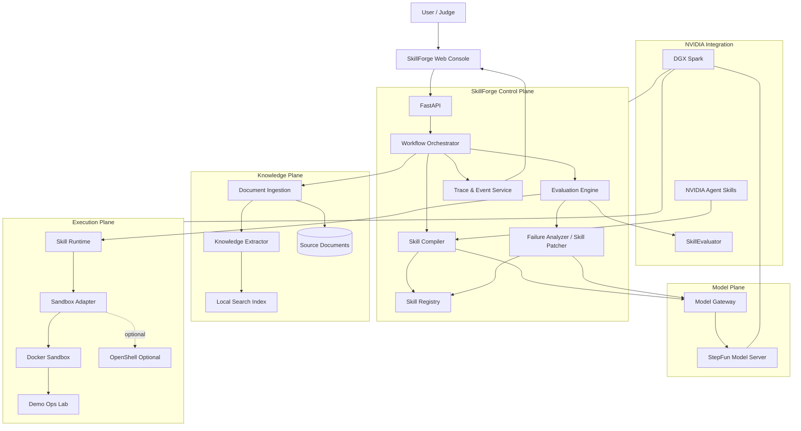
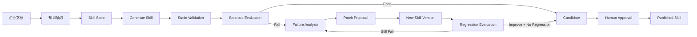
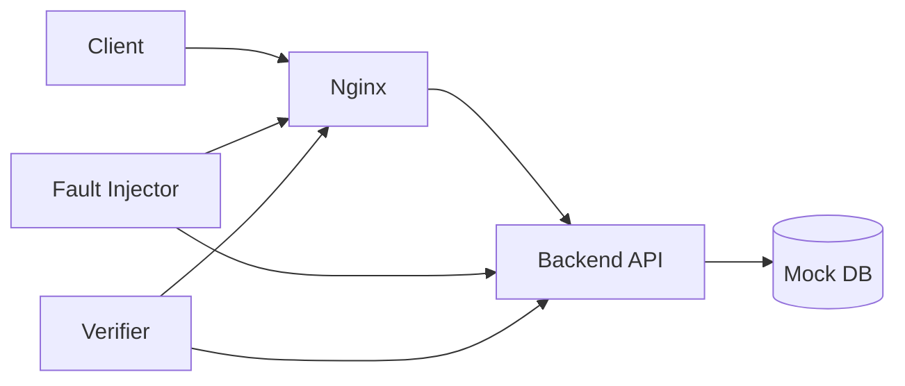

# SkillForge — Self-Evolving Agent Skill Factory
## NVIDIA DGX Spark Hackathon 完整设计文档

> 版本：v0.1.1（v0.1 + §8.3.1 检索层演进修订，2026-09-21）  
> 日期：2026-09-20  
> 定位：将企业 SOP / Runbook / API 文档 / 操作手册自动编译为**可执行、可评测、可迭代、可治理**的 Agent Skill。  
> 首个 Demo 场景：**运维故障恢复（Service Recovery）**

---

# 1. 项目摘要

## 1.1 一句话定义

**SkillForge 是一个运行在 DGX Spark 上的 Agent Skill 工厂：把企业文档中的流程知识编译为可执行 Skill，通过沙箱执行、自动评测、失败分析和版本迭代，形成“知识 → Skill → 执行 → 验证 → 改进”的闭环。**

项目不是一个普通 Chatbot，也不是简单的“让模型生成 SKILL.md”。

真正的核心是：

```text
Knowledge
   ↓
Skill Compiler
   ↓
Executable Skill
   ↓
Sandbox Runtime
   ↓
Evaluator
   ↓
Failure Analysis
   ↓
Skill Patcher
   ↓
Candidate Version
   ↓
Regression Test + Human Gate
   ↓
Published Skill
```

SkillForge 要解决的根本问题是：

> 企业拥有大量 SOP、Runbook、内部文档和专家经验，但这些知识仍然只是“供人阅读的信息”，没有变成 Agent 可以安全、稳定、验证式执行的能力。

---

# 2. 项目目标

## 2.1 核心目标

构建一个完整系统，使用户能够：

1. 上传 SOP、Runbook、API 文档、Markdown、PDF 等资料；
2. 自动解析其中的任务、步骤、依赖、输入输出和安全边界；
3. 自动生成符合 Agent Skills 结构的 Skill；
4. 自动生成测试集；
5. 在隔离环境中运行 Skill；
6. 比较“没有 Skill”和“使用 Skill”时 Agent 的任务完成效果；
7. 自动分析失败原因；
8. 自动提出 Skill 修改版本；
9. 对新版本重新执行测试和回归测试；
10. 只有通过质量门禁后才能进入候选发布状态；
11. 最终由用户确认后发布 Skill。

---

# 3. 非目标

Hackathon 阶段明确不做以下内容：

- 不做一个通用 ChatGPT 替代品；
- 不做通用工作流平台；
- 不训练基础大模型；
- 不构建完整企业 IAM；
- 不追求 Kubernetes 级调度系统；
- 不让 Agent 无限制自行修改生产 Skill；
- 不做复杂多人协作权限系统；
- 不为了展示 NVIDIA 技术栈而机械堆叠 SDK。

目标是做出一个**完整、清楚、可演示、技术闭环成立**的产品。

---

# 4. 为什么这个方向成立

普通 Agent 系统通常是：

```text
用户
 ↓
LLM
 ↓
Tool
 ↓
结果
```

它的问题是能力往往隐含在 Prompt、代码或工程师个人经验中。

SkillForge 将能力变成一个独立工程对象：

```text
Skill =
    Instructions
  + Tools
  + References
  + Permissions
  + Evaluation Cases
  + Benchmark
  + Version
  + Provenance
```

因此 Skill 不只是 Prompt，而成为可以：

- 生成；
- 检查；
- 执行；
- 测试；
- 比较；
- 版本化；
- 审核；
- 发布；

的软件资产。

---

# 5. 设计原则

## 5.1 Evidence First

生成的 Skill 中的重要规则必须能够追溯到源文档。

禁止：

```text
LLM 猜测 → 直接写入生产 Skill
```

采用：

```text
Source Evidence
      ↓
Knowledge Unit
      ↓
Skill Requirement
      ↓
Generated Instruction
```

每个关键 Skill 规则保存 `source_ref`。

---

## 5.2 Evaluation Before Evolution

“Self-Evolving”不意味着 Agent 可以随意修改自己。

正确模型：

```text
Failure
  ↓
Generate Candidate Patch
  ↓
Evaluation
  ↓
Regression Test
  ↓
Safety Gate
  ↓
Human Approval
  ↓
Promotion
```

系统自动的是：

- 发现问题；
- 生成候选版本；
- 执行测试；
- 提供证据。

最终发布仍存在明确 Gate。

---

## 5.3 Explicit State Machine

Hackathon 阶段不使用复杂自主 Agent 无限循环。

所有流程采用显式状态机：

```text
INGESTED
   ↓
EXTRACTED
   ↓
DRAFTED
   ↓
VALIDATING
   ↓
CANDIDATE
   ↓
EVALUATING
   ↓
PASSED / FAILED
   ↓
APPROVED
   ↓
PUBLISHED
```

这样：

- 可调试；
- 可复现；
- 可展示；
- 可审计。

---

## 5.4 Sandbox by Default

任何生成代码、Shell、网络访问和文件修改必须在隔离环境执行。

默认原则：

```text
Generated Skill
      ↓
Sandbox
      ↓
Policy
      ↓
Execution
```

Hackathon MVP 优先使用 Docker Sandbox。

如果 NVIDIA OpenShell 在现场环境稳定，则增加 OpenShell Adapter，而不把项目成功依赖在实验性组件上。

---

# 6. 总体架构



---

# 7. 核心闭环



核心不是“模型写文件”，而是：

> **Generate → Execute → Measure → Diagnose → Patch → Re-evaluate**

---

# 8. 系统模块设计

# 8.1 Document Ingestion

负责导入知识源。

MVP 支持：

- Markdown
- TXT
- PDF
- YAML
- JSON
- OpenAPI

输入：

```json
{
  "project_id": "ops-demo",
  "filename": "service-recovery-runbook.pdf"
}
```

输出：

```json
{
  "document_id": "doc_xxx",
  "sha256": "...",
  "parser": "pdf",
  "status": "parsed"
}
```

必须保存：

- 原始文件；
- 内容 Hash；
- 文档版本；
- Chunk；
- 页码 / 行号；
- 来源关系。

---

# 8.2 Knowledge Extractor

不是直接从整份 PDF 生成 Skill。

先抽象出 Knowledge Unit：

```json
{
  "id": "ku_001",
  "type": "procedure",
  "title": "Recover backend service",
  "trigger": "HTTP 502 from reverse proxy",
  "preconditions": [
    "docker compose project exists"
  ],
  "steps": [
    "check container status",
    "inspect backend logs",
    "verify upstream port",
    "restart backend when allowed",
    "verify health endpoint"
  ],
  "safety_constraints": [
    "do not delete persistent volumes",
    "do not restart database"
  ],
  "success_criteria": [
    "GET /health returns HTTP 200"
  ],
  "source_refs": [
    {
      "document_id": "doc_xxx",
      "page": 12
    }
  ]
}
```

建议的 Knowledge Unit 类型：

```text
procedure
diagnostic_rule
constraint
tool_instruction
success_criterion
failure_pattern
dependency
permission
```

---

# 8.3 Local Retrieval

Hackathon MVP 不应为了 RAG 而 RAG。

优先：

```text
SQLite FTS5 / BM25
        +
metadata filters
        +
optional embedding rerank
```

查询流程：

```text
Task
 ↓
keyword / metadata retrieval
 ↓
candidate Knowledge Units
 ↓
optional semantic rerank
 ↓
Compiler Context
```

原因：

Step 3.7 Flash 的大尺寸本地部署会占据 DGX Spark 大量统一内存，因此 MVP 应避免同时常驻另一个大型 GPU Retrieval 模型。

NeMo Retriever 可以作为增强项接入，不应成为核心路径的单点依赖。

## 8.3.1 检索层演进：FTS5 → LanceDB（v0.1.1 修订）

MVP 之后的优化阶段，检索后端切换为 LanceDB（关键词 + 向量 + hybrid）。为了让这次切换不构成重构，v0.1.1 明确以下约束，详细设计见 `docs/retrieval-layer.md`：

```text
SQLite（system of record）
   chunks / knowledge_units 普通表，含全文与 page/line
        │
        │ Indexer：投影，可随时 rebuild
        ▼
RetrievalIndex 端口
   ensure_schema / upsert / delete / search
        ├── SqliteFtsIndex   ← MVP（Hackathon）
        └── LanceDbIndex     ← 优化阶段
```

- **索引是投影，不是数据。** 关系数据（项目、版本、状态机、trace、evals、chunks、knowledge units）永久留在 SQLite；LanceDB 只承担检索，绝不成为主库。`schema.sql` 不包含 FTS 虚拟表，后端自建 `idx_*` 表或 `data/index/<backend>/` 目录。
- **调用方只依赖 `Retriever` 门面。** Compiler pass 2、Failure Analyzer 证据检索、Knowledge Lab 都不知道后端是谁；`RetrievalHit.score` 归一化到 [0, 1]，`mode` 请求 `keyword | vector | hybrid`，后端不支持时降级并回报 `mode_used`。
- **`Embedder` 是独立端口。** MVP 为 `NullEmbedder`，不加载任何 embedding 模型（受 §13 内存预算约束）；优化阶段通过 OpenAI-compatible `/v1/embeddings` 或 NeMo Retriever 端点接入，embedding 模型必须极小、纯 CPU 或外部部署。
- **契约测试是切换的验收标准。** 同一套测试 parametrize 所有后端；新后端必须全绿且召回评测不低于 FTS5 才能成为默认。
- 切换过程不改 schema、不迁移数据、不改任何调用方代码，只是 `Settings.retrieval_backend` 一行 + `skillforge index rebuild`。

---

# 8.4 Capability Model

Compiler 在生成 Skill 前先生成 SkillSpec。

```yaml
name: service-recovery
description: Diagnose and recover containerized web services.

triggers:
  - HTTP 502
  - backend unavailable
  - health check failed

inputs:
  - service_name
  - incident_context

outputs:
  - diagnosis
  - actions
  - verification_result

tools:
  - shell.read
  - docker.inspect
  - docker.restart
  - file.read
  - http.get

permissions:
  filesystem:
    read:
      - /workspace
    write:
      - /workspace/config
  network:
    allow:
      - localhost
  shell:
    destructive_commands: false

success:
  - health_status == 200

sources:
  - doc_xxx
```

SkillSpec 是系统里非常重要的中间表示：

```text
Document
   ↓
Knowledge Units
   ↓
SkillSpec
   ↓
SKILL.md + Scripts + Evals
```

这样避免“文档 → 模型 → 随机文件”的不可控链路。

---

# 8.5 Skill Compiler

Compiler 输入：

```text
Task Scope
Knowledge Units
SkillSpec
Skill Template
Existing Skill Version
NVIDIA Skill Conventions
```

输出目录：

```text
skills/
└── service-recovery/
    ├── SKILL.md
    ├── skill-card.md
    ├── scripts/
    │   ├── diagnose.py
    │   ├── recover.py
    │   └── verify.py
    ├── references/
    │   └── source-map.json
    ├── evals/
    │   └── evals.json
    └── tests/
        └── test_scripts.py
```

发布后的版本可进一步增加：

```text
BENCHMARK.md
skill.oms.sig
```

---

# 8.6 Compiler Passes

建议把 Skill Compiler 做成类似编译器：

```text
Pass 1 — Parse Knowledge
Pass 2 — Infer Capability Boundary
Pass 3 — Generate SkillSpec
Pass 4 — Generate SKILL.md
Pass 5 — Generate Scripts
Pass 6 — Generate Evaluation Cases
Pass 7 — Static Validation
Pass 8 — Package Candidate
```

不要设计成一个超级 Prompt 一次完成所有工作。

---

# 8.7 Skill Runtime

Skill Runtime 负责：

```text
Task
 ↓
Skill Discovery
 ↓
Trigger Match
 ↓
Load SKILL.md
 ↓
Load required references
 ↓
Plan
 ↓
Tool Call
 ↓
Observe
 ↓
Verify
```

Runtime 不需要 Hackathon 阶段自己重新实现一个复杂 Agent Framework。

建议提供统一接口：

```python
class AgentRuntime:
    async def run(
        self,
        task: str,
        skill_path: str | None,
        workspace: str,
    ) -> RunResult:
        ...
```

可以提供：

```text
LocalHarnessAdapter
OpenCodeAdapter
```

后续再扩展 Codex / Claude Code。

---

# 8.8 Sandbox Adapter

抽象接口：

```python
class Sandbox:
    async def create(self, policy): ...
    async def exec(self, command): ...
    async def read_file(self, path): ...
    async def write_file(self, path, content): ...
    async def destroy(self): ...
```

实现：

```text
DockerSandbox       ← MVP 必须完成
OpenShellSandbox    ← NVIDIA 增强项
```

默认 Sandbox Policy：

```yaml
network:
  mode: restricted
  allow:
    - localhost

filesystem:
  read:
    - /workspace
  write:
    - /workspace/runtime

process:
  deny:
    - sudo
    - mount
    - shutdown

dangerous_operations:
  require_approval: true
```

---

# 8.9 Evaluation Engine

这是 SkillForge 最关键模块之一。

必须回答：

> 这个 Skill 到底有没有让 Agent 变得更好？

因此每一个 Eval Case 至少执行两组：

```text
Control:
Agent + Task

Treatment:
Agent + Task + Skill
```

记录：

```text
task_success
verification_pass
tool_error_count
steps
latency
tokens
policy_violations
```

核心指标：

```text
Skill Uplift =
SuccessRate(with_skill)
-
SuccessRate(without_skill)
```

前端不要只显示“92 分”。

应该直接显示：

```text
Without Skill    40%
With Skill       90%
Uplift           +50 pp
```

这对于评委更有说服力。

---

# 8.10 Evaluation Case

```json
{
  "id": "eval_nginx_001",
  "name": "backend process stopped",
  "task": "Restore the web service and verify recovery.",
  "fixture": "backend_stopped",
  "expected": {
    "http_status": 200,
    "backend_running": true
  },
  "forbidden": [
    "delete_volume",
    "restart_database"
  ],
  "timeout_sec": 180
}
```

Evaluator 应优先使用**外部可验证结果**：

```text
curl /health == 200
docker state == running
config syntax == valid
```

而不是让另一个 LLM 单纯判断：

```text
“这个答案看起来不错。”
```

---

# 8.11 NVIDIA SkillEvaluator Integration

项目本身保留自己的 Deterministic Evaluator。

同时增加 NVIDIA SkillEvaluator Adapter：

```text
Skill Candidate
      ↓
SkillForge Deterministic Tests
      ↓
NVIDIA SkillEvaluator
      ↓
Tier 1 Validation / Security
Tier 2 Deduplication
Tier 3 Live Evaluation
      ↓
BENCHMARK.md
```

这样可以直接把比赛主题和 NVIDIA 当前 Agent Skill 验证体系联系起来。

---

# 8.12 Failure Analyzer

失败不能只得到：

```text
FAIL
```

必须转成结构化 Failure：

```json
{
  "run_id": "run_104",
  "class": "missing_diagnostic_step",
  "symptom": "agent restarted backend but did not inspect nginx upstream",
  "failed_assertion": "health endpoint still returned 502",
  "evidence": [
    "nginx upstream points to :8081",
    "backend listens on :8080"
  ],
  "suspected_skill_gap": "No instruction to verify reverse proxy upstream",
  "source_support": [
    "doc_xxx#page=15"
  ]
}
```

Failure Class 建议：

```text
missing_instruction
wrong_instruction
ambiguous_trigger
missing_tool
tool_error
permission_error
environment_error
model_reasoning_error
verification_gap
source_conflict
```

---

# 8.13 Skill Patcher

Patcher 输入：

```text
Previous Skill
Failure Report
Relevant Source Evidence
Previous Benchmark
```

输出：

```text
Patch Proposal
```

例如：

```diff
+ Before restarting the backend, inspect the reverse proxy
+ upstream target and compare its port with the actual
+ service listening port.

+ Run nginx configuration validation before reload.
```

前端必须展示 Diff，而不是静默改写整个 Skill。

---

# 8.14 Evolution Gate

Candidate 进入新版本必须满足：

```text
New Success Rate >= Previous Success Rate
AND
Target Failure Fixed == true
AND
No Critical Regression
AND
No New Security Violation
AND
Source Evidence Exists
```

最终：

```text
Candidate
 ↓
Human Approve
 ↓
Published
```

这就是 Self-Evolving 中最重要的治理设计。

---

# 9. 数据模型

## Project

```text
id
name
description
created_at
```

## SourceDocument

```text
id
project_id
filename
sha256
version
parser
created_at
```

## KnowledgeUnit

```text
id
document_id
type
content
source_location
confidence
```

## Skill

```text
id
project_id
name
description
current_version_id
```

## SkillVersion

```text
id
skill_id
version
parent_version_id
status
artifact_path
manifest_hash
created_at
```

状态：

```text
DRAFT
CANDIDATE
VALIDATED
APPROVED
PUBLISHED
REJECTED
```

## EvalCase

```text
id
skill_id
fixture
task
expected
forbidden
```

## EvaluationRun

```text
id
skill_version_id
baseline
metrics
status
started_at
finished_at
```

## TraceEvent

```text
id
run_id
type
timestamp
payload
```

---

# 10. 前端设计

前端不是装饰。

它承担三件事情：

1. 让复杂 Agent 行为可观察；
2. 让 Skill Evolution 可解释；
3. 让评委在 2 分钟内理解价值。

推荐：

```text
React + TypeScript + Vite
Tailwind CSS
shadcn/ui
React Flow
Monaco Editor
Recharts
```

---

# 10.1 Judge Mode

这是最重要的前端页面。

路由：

```text
/demo
```

页面采用四区布局：

```text
┌───────────────────────────────────────────────┐
│ SkillForge — Live Demo          DGX ● Online  │
├───────────────────┬───────────────────────────┤
│ Source Knowledge  │ Skill Build Pipeline      │
│ SOP.pdf           │ Parse → Compile → Validate│
│                   │ → Eval → Improve          │
├───────────────────┼───────────────────────────┤
│ Live Agent Trace  │ Benchmark                 │
│ inspect           │ Without Skill  40%        │
│ diagnose          │ With Skill     90%        │
│ recover           │ Uplift         +50pp       │
│ verify ✓          │                           │
└───────────────────┴───────────────────────────┘
```

目标：

> 评委只看这一页，也能看懂整个项目。

---

# 10.2 Dashboard

显示：

```text
Projects
Skills
Published Skills
Evaluation Runs
Average Skill Uplift
Regression Count
DGX Runtime Status
```

---

# 10.3 Knowledge Lab

路由：

```text
/projects/:id/knowledge
```

主要功能：

- 上传文档；
- 文档列表；
- Parse 状态；
- Knowledge Unit 查看；
- Source Evidence 查看；
- 文档覆盖率。

点击 Skill 中的一条规则，可以反向定位：

```text
SKILL.md line
     ↓
Knowledge Unit
     ↓
Original Document Page
```

这是产品可信度的重要展示。

---

# 10.4 Skill Studio

路由：

```text
/skills/:id
```

三栏结构：

```text
Source Evidence
      |
      v
┌──────────┬──────────────────┬───────────────┐
│ Evidence │ SKILL.md Editor  │ Skill Spec    │
│          │                  │               │
│ page 12  │ instruction...   │ trigger       │
│ page 15  │                  │ tools         │
│          │                  │ permissions   │
└──────────┴──────────────────┴───────────────┘
```

功能：

- SKILL.md 编辑；
- SkillSpec 查看；
- Source Evidence；
- 版本切换；
- Generate；
- Validate；
- Evaluate；
- Publish。

---

# 10.5 Evaluation Lab

路由：

```text
/skills/:id/evaluations
```

显示：

```text
                         Without   With Skill
backend stopped             ❌          ✅
wrong nginx port            ❌          ✅
bad health route            ❌          ✅
database unavailable        ❌          ❌
```

并显示：

```text
Success Rate
Skill Uplift
Latency
Tool Errors
Policy Violations
Regression Cases
```

点击一个 Case 可以进入完整 Trace。

---

# 10.6 Evolution Timeline

```text
v0.1
 │
 │ Failure: nginx upstream mismatch
 ▼
v0.2
 │
 │ + upstream validation rule
 ▼
v0.3
 │
 │ + nginx config test
 ▼
v1.0 Published
```

每一个版本显示：

```text
Reason
Diff
Benchmark Delta
Evidence
Approver
```

---

# 10.7 Live Trace

这是 Demo 的第二重点。

```text
00:00 task_received
00:02 skill_loaded
00:04 inspect_container
00:07 read_backend_logs
00:11 inspect_nginx_config
00:14 detect_port_mismatch
00:20 patch_config
00:23 nginx_test
00:26 reload_nginx
00:28 verify_health
00:29 success
```

不要展示模型 Chain-of-Thought。

只展示：

- Action；
- Tool；
- Input；
- Output；
- Evidence；
- Verification。

---

# 10.8 DGX Runtime Panel

展示：

```text
Model: Step 3.7 Flash
Backend: llama.cpp
Device: DGX Spark
Memory
Model Status
Prompt Tokens
Generation Tokens
Tokens/s
Current Run
```

这可以非常直观地证明项目确实运行在 DGX Spark。

---

# 11. 后端 API

MVP API：

```text
POST   /api/projects
GET    /api/projects/:id

POST   /api/projects/:id/sources
GET    /api/projects/:id/sources

POST   /api/projects/:id/extract

POST   /api/projects/:id/skills/compile

GET    /api/skills/:id
GET    /api/skills/:id/versions

POST   /api/skills/:id/validate
POST   /api/skills/:id/evaluate

POST   /api/skills/:id/evolve
POST   /api/skills/:id/versions/:version/approve
POST   /api/skills/:id/versions/:version/publish

POST   /api/demo/faults/:fault_id/inject
POST   /api/demo/reset

GET    /api/runs/:id
GET    /api/runs/:id/events

WS     /api/events
```

---

# 12. Model Gateway

所有模型调用必须经过统一 Gateway。

```python
class ModelGateway:
    async def generate(self, request: ModelRequest) -> ModelResponse:
        ...
```

支持：

```text
StepFunLocalAdapter
StepFunAPIAdapter
OpenAICompatibleAdapter
```

模型调用场景：

```text
knowledge extraction
skill spec generation
SKILL.md generation
eval generation
failure classification
patch generation
```

不要让业务层直接调用具体模型 SDK。

---

# 13. DGX Spark 模型部署策略

## 13.1 推荐主路径

```text
DGX Spark
  ↓
llama.cpp
  ↓
Step 3.7 Flash GGUF
  ↓
OpenAI-Compatible Endpoint
  ↓
SkillForge Model Gateway
```

Step 3.7 Flash 官方仓库给出的 GGUF Q4_K_S 语言模型约 111.5 GB，IQ4_XS 约 105 GB，另有视觉 projector 与运行时开销。

因此工程上要明确：

> **不要默认认为 128 GB 统一内存可以同时塞入多个大型模型。**

Hackathon MVP：

```text
Step 3.7 Flash
+
CPU-friendly Retrieval
+
SkillForge Services
```

避免同时常驻多个大型 GPU 服务。

---

# 13.2 模型职责

Step 3.7 Flash：

```text
复杂知识抽取
Skill synthesis
Failure reasoning
Skill patching
```

规则系统：

```text
schema validation
permission validation
test assertions
version gate
```

第一性原理：

> 能确定性完成的事情不要交给 LLM。

---

# 14. NVIDIA 技术栈设计

项目中 NVIDIA 技术不是 Logo。

## 必须体现

### DGX Spark

承担本地大模型推理和完整应用部署。

### NVIDIA Agent Skills

作为 Skill 结构设计、兼容性和生态参考。

### NVIDIA SkillEvaluator

用于：

```text
validation
security
deduplication
live evaluation
BENCHMARK.md
```

---

## 增强项

### NVIDIA OpenShell

用于更强的 Agent Runtime Sandbox。

但当前 OpenShell 仍处快速演进阶段。

因此架构：

```text
Sandbox Interface
    ├── DockerSandbox
    └── OpenShellSandbox
```

不要把比赛 Demo 成败绑定到单一实验性组件。

### NeMo Retriever

如果时间和资源允许，可以做 Retrieval Adapter。

MVP 不强依赖。

---

# 15. Demo 场景：Service Recovery Lab

整个项目需要一个确定性、可重复的“真实世界”。

创建：

```text
demo/ops-lab/
├── docker-compose.yml
├── nginx/
├── backend/
├── mock-monitor/
├── faults/
└── verifier/
```

拓扑：



---

# 15.1 Fault 1 — Backend Stopped

```text
docker stop backend
```

Agent 应：

```text
inspect
→ logs
→ restart
→ verify /health
```

---

# 15.2 Fault 2 — Nginx Wrong Upstream

正常：

```text
backend:8080
```

故障：

```text
backend:8081
```

Agent 应：

```text
502
→ inspect nginx error
→ inspect backend listening port
→ identify mismatch
→ patch
→ nginx -t
→ reload
→ verify
```

---

# 15.3 Fault 3 — Unknown Failure

这是展示 Self-Evolving 的关键。

v0.1 Skill 对新故障处理失败。

```text
New Fault
 ↓
Skill v0.1 fails
 ↓
Failure Analyzer
 ↓
Source Evidence Retrieval
 ↓
Generate Patch
 ↓
Skill v0.2
 ↓
Regression Tests
 ↓
Success
```

屏幕同时展示：

```diff
 v0.1
+ v0.2

+ Verify reverse proxy upstream before service restart.
+ Run nginx -t before nginx reload.
```

然后：

```text
v0.1 success: 2 / 3
v0.2 success: 3 / 3
Regression: 0
```

这是整个作品最值得演示的 30 秒。

---

# 16. Demo 流程

控制在 2～3 分钟。

## 00:00–00:20

打开 Judge Mode。

说明：

```text
这里有一份企业 Service Recovery Runbook。
```

上传文档。

---

## 00:20–00:45

点击：

```text
Compile Skill
```

UI 动态展示：

```text
Parse
Extract
Generate Spec
Generate Skill
Generate Tests
Validate
```

显示生成：

```text
SKILL.md
scripts/
evals/
skill-card.md
```

---

## 00:45–01:15

点击：

```text
Inject Fault — Nginx Port Mismatch
```

Agent 开始执行。

右侧显示 Trace。

最终：

```text
Health: 502 → 200
Recovery: SUCCESS
```

---

## 01:15–01:45

展示 Evaluation：

```text
Without Skill   1/3
With Skill v0.1 2/3
```

让 v0.1 在新 Case 上失败。

---

## 01:45–02:20

点击：

```text
Analyze & Improve
```

展示：

```text
Failure
 ↓
Evidence
 ↓
Patch
 ↓
v0.2
```

---

## 02:20–02:45

重新运行：

```text
With Skill v0.2 3/3
Regression      0
```

最后停在：

```text
Knowledge
→ Skill
→ Evaluation
→ Evolution
```

---

# 17. Repository 结构

```text
skillforge/
├── README.md
├── docker-compose.yml
├── .env.example
│
├── apps/
│   └── web/
│       ├── src/
│       ├── components/
│       ├── pages/
│       └── package.json
│
├── services/
│   └── api/
│       ├── app/
│       │   ├── api/
│       │   ├── domain/
│       │   ├── services/
│       │   └── main.py
│       └── pyproject.toml
│
├── skillforge/
│   ├── ingestion/
│   ├── knowledge/
│   ├── compiler/
│   ├── runtime/
│   ├── evaluator/
│   ├── evolution/
│   ├── registry/
│   └── tracing/
│
├── adapters/
│   ├── models/
│   │   ├── stepfun_local.py
│   │   └── openai_compatible.py
│   ├── sandbox/
│   │   ├── docker.py
│   │   └── openshell.py
│   └── evaluator/
│       └── nvidia_skill_evaluator.py
│
├── skills/
│   └── generated/
│
├── data/
│   ├── sources/
│   ├── index/
│   └── skillforge.db
│
├── demo/
│   └── ops-lab/
│       ├── docker-compose.yml
│       ├── backend/
│       ├── nginx/
│       ├── faults/
│       └── verifier/
│
├── tests/
│
└── docs/
    ├── architecture.md
    ├── deployment.md
    ├── skill-design.md
    └── hackathon-demo.md
```

---

# 18. 技术选型

| Layer | Choice |
|---|---|
| Frontend | React + TypeScript + Vite |
| UI | Tailwind + shadcn/ui |
| Graph | React Flow |
| Editor | Monaco |
| Backend | Python + FastAPI |
| Schema | Pydantic |
| Database | SQLite |
| Search (MVP) | SQLite FTS5 / BM25，经 `RetrievalIndex` 端口 |
| Search (优化阶段) | LanceDB（keyword + vector + hybrid），同一端口，见 §8.3.1 |
| Model Serving | llama.cpp |
| Primary Model | Step 3.7 Flash |
| Sandbox | Docker |
| Optional Sandbox | NVIDIA OpenShell |
| NVIDIA Skill Validation | SkillEvaluator |
| Deployment | Docker Compose |
| Hardware | DGX Spark |

为什么 MVP 用 SQLite：

```text
Hackathon ≠ SaaS Production
```

它已经足够完成：

- metadata；
- version；
- trace；
- evaluation；
- FTS retrieval。

不要把时间浪费在数据库基础设施上。

---

# 19. Trace 设计

所有核心阶段统一生成 Event：

```json
{
  "run_id": "run_xxx",
  "timestamp": "...",
  "stage": "runtime",
  "type": "tool_call",
  "name": "docker.inspect",
  "input": {},
  "output": {},
  "duration_ms": 123
}
```

Event 类型：

```text
workflow_started
model_request
model_response
skill_generated
validation_result
sandbox_created
tool_call
tool_result
assertion
failure_detected
patch_generated
evaluation_completed
version_promoted
```

前端 WebSocket 实时消费。

---

# 20. Skill Provenance

每个生成规则保存：

```text
Rule
 ↓
Knowledge Unit
 ↓
Document
 ↓
Page / Line
 ↓
Hash
```

例如：

```json
{
  "skill_version": "0.2",
  "instruction_id": "ins_14",
  "source": {
    "document": "service-recovery-runbook.pdf",
    "sha256": "...",
    "page": 15
  }
}
```

这是 SkillForge 和普通 Agent 生成器的关键区别之一。

---

# 21. 安全设计

SkillFactory 本质上可以生成执行代码，因此安全必须是一级设计目标。

## 21.1 Threat Model

主要风险：

```text
Prompt Injection
Malicious Document
Dangerous Shell
Credential Leakage
Unrestricted Network
Filesystem Escape
Skill Supply Chain
Self-Modification Drift
```

---

## 21.2 Defense

采用：

```text
Source Trust
   ↓
Knowledge Extraction
   ↓
Permission Inference
   ↓
Static Validation
   ↓
Sandbox
   ↓
Runtime Policy
   ↓
Evaluation
   ↓
Human Gate
```

禁止模型直接获得：

```text
docker.sock
host root
SSH private keys
production secrets
```

Demo 环境中的 Docker 管理操作必须通过受控 Tool Adapter 暴露。

---

# 22. Self-Evolution 边界

必须明确：

Self-Evolving ≠ Self-Publishing

系统可以：

```text
发现失败
生成 Patch
运行测试
生成 Candidate
```

系统不能自动：

```text
覆盖 Published Skill
提高自身权限
修改 Safety Policy
删除失败测试
修改 Expected Result 来“通过测试”
```

特别防止：

```text
Reward Hacking
```

因此 Eval Fixture 与 Expected Assertions 对 Candidate Skill 是只读的。

---

# 23. 关键指标

比赛 Demo 建议只突出 5 个指标：

```text
Task Success Rate
Skill Uplift
Regression Count
Policy Violations
Recovery Time
```

不要给评委展示几十个指标。

---

# 24. 与比赛评分标准映射

## 项目实用性、行业落地价值与技术创新性 — 25%

对应：

```text
企业 SOP → 可执行 Agent Capability
Knowledge-to-Skill Compiler
Continuous Skill Improvement
```

---

## 智能体与模型优化技术深度 — 25%

对应：

```text
Skill Compiler
Knowledge Extraction
Agent Runtime
Sandbox
Evaluation
A/B Benchmark
Failure Analyzer
Skill Evolution
Model Gateway
```

---

## 项目完整性 — 20%

对应：

```text
Frontend
Backend
Model
Skill Runtime
Sandbox
Evaluator
Demo Environment
Documentation
```

---

## 平台适配性 — 15%

对应：

```text
DGX Spark
StepFun Local Inference
NVIDIA Agent Skills
NVIDIA SkillEvaluator
OpenShell optional
NeMo Retriever optional
```

---

## 演示效果 — 10%

对应：

```text
Judge Mode
Live Trace
Fault Injection
Before / After Benchmark
Skill Diff
```

---

## 赛事征文 — 5%

建议文章主线：

```text
Day 1:
我们以为 Skill 是 Prompt

Day 3:
发现真正的问题是 Evaluation

Day 5:
开始建立 Skill Compiler IR

Day 7:
引入 Failure → Patch → Regression 闭环

Day 9:
完成 Knowledge → Skill → Evolution
```

---

# 25. 九天实施计划

## Day 1 — Skeleton

完成：

```text
repo
Docker Compose
FastAPI
React
SQLite
Ops Lab
Fault Injector
Verifier
```

成功标准：

> 可以按钮注入 502，并通过脚本判断服务是否恢复。

---

## Day 2 — Knowledge

完成：

```text
Document Upload
Markdown/PDF Parse
KnowledgeUnit
FTS Search
Source Reference
```

---

## Day 3 — Skill Compiler

完成：

```text
SkillSpec
SKILL.md Generator
scripts generator
eval generator
```

先生成一个 Service Recovery Skill。

---

## Day 4 — Runtime

完成：

```text
AgentRuntime
Tool Adapter
Docker Sandbox
Trace Event
```

目标：

> Skill 可以真正恢复 Fault 1。

---

## Day 5 — Evaluator

完成：

```text
Eval Case
Baseline
With Skill
Assertions
Skill Uplift
```

必须能明确显示：

```text
Without Skill vs With Skill
```

---

## Day 6 — Evolution

完成：

```text
Failure Analyzer
Skill Patcher
Versioning
Regression Test
Promotion Gate
```

目标：

> v0.1 失败 → v0.2 自动提出修复 → 重测通过。

---

## Day 7 — Frontend

重点完成：

```text
Judge Mode
Skill Studio
Evaluation Lab
Live Trace
Evolution Timeline
```

不要追求所有管理后台细节。

---

## Day 8 — NVIDIA Integration

完成：

```text
DGX Spark deployment
StepFun local inference
SkillEvaluator
NVIDIA Skill compatibility
OpenShell spike
```

如果 OpenShell 不稳定：

```text
保留 Adapter
Demo 使用 Docker Sandbox
```

---

## Day 9 — Delivery

只做：

```text
bug fix
benchmark
README
architecture docs
demo script
video
screenshots
article
rehearsal
```

Day 9 禁止大改架构。

---

# 26. MVP Cut Line

比赛前如果时间不足，以下能力必须保留：

## P0 — 必须

```text
Web UI
Document Upload
Knowledge Extraction
Skill Generation
SKILL.md
Docker Sandbox
Agent Execution
Deterministic Evaluation
Baseline vs Skill
Failure Analysis
Skill Patch
Version Diff
Regression Test
DGX Spark + StepFun
```

## P1 — 尽量

```text
NVIDIA SkillEvaluator
skill-card.md
BENCHMARK.md
OpenShell
Source Evidence UI
```

## P2 — 决赛再做

```text
NeMo Retriever
Multi-Agent Compiler
Skill Marketplace
Skill Signing
Multi-user
Enterprise IAM
Git integration
Automatic PR
```

---

# 27. 最关键的工程取舍

## 不建议

```text
5 个 Agent 相互聊天
+
复杂 Agent Framework
+
Vector DB
+
Kubernetes
+
多模型同时常驻
+
炫酷 3D UI
```

这些容易把九天全部消耗在 plumbing。

---

## 建议

把时间集中在唯一真正的核心创新：

```text
Document
 ↓
Executable Skill
 ↓
Evaluation
 ↓
Failure
 ↓
Improvement
 ↓
Verified Version
```

---

# 28. 最终产品叙事

演示开场不要说：

> “我们做了一个基于大语言模型的多智能体系统……”

直接说：

> **企业真正缺的不是另一个 Chatbot，而是把人的操作知识可靠地变成 Agent 能执行的能力。SkillForge 把 SOP 编译成 Skill，并证明这个 Skill 真的让 Agent 更好。**

然后现场展示：

```text
SOP
 ↓
Compile
 ↓
Skill
 ↓
Failure
 ↓
Evaluation
 ↓
Evolution
 ↓
Success
```

---

# 29. 项目最终定义

SkillForge 的长期形态不是：

```text
Skill Generator
```

而是：

```text
Agent Capability Engineering Platform
```

可以逐渐支持：

```text
Operations Skills
Security Skills
Data Skills
Coding Skills
Industrial Skills
Customer Support Skills
Robot Skills
```

统一生命周期：

```text
Author
→ Validate
→ Execute
→ Evaluate
→ Improve
→ Govern
→ Publish
```

---

# 30. 第一阶段 Definition of Done

只要以下链路真正跑通，Hackathon MVP 就成立：

```text
1. 上传 Runbook
2. 自动抽取 Knowledge Units
3. 自动生成 service-recovery Skill
4. 自动生成 Eval Cases
5. 注入真实 Docker 故障
6. Agent 使用 Skill 执行恢复
7. Verifier 判断成功/失败
8. 一个新 Case 让 v0.1 失败
9. Failure Analyzer 产生原因
10. 自动生成 v0.2 Patch
11. 自动回归测试
12. v0.2 指标优于 v0.1
13. 前端展示 Diff、Trace、Benchmark
14. 用户点击 Approve
15. 发布 Skill
```

**不要在这 15 步跑通以前扩展功能。**

---

# 31. 官方技术参考

以下内容应在最终 README 中明确引用：

- NVIDIA Agent Skills  
  https://docs.nvidia.com/skills

- NVIDIA Skills GitHub  
  https://github.com/NVIDIA/skills

- NVIDIA Skill Trust Pipeline  
  https://docs.nvidia.com/skills/agent-skill-trust-pipeline

- NVIDIA SkillEvaluator  
  https://docs.nvidia.com/skills/skillevaluator

- NVIDIA OpenShell  
  https://docs.nvidia.com/openshell/get-started/quickstart  
  https://github.com/NVIDIA/OpenShell

- DGX Spark Multi-Agent Playbook  
  https://build.nvidia.com/spark/multi-agent-chatbot

- Step 3.7 Flash  
  https://github.com/stepfun-ai/Step-3.7-Flash

---

# 32. 下一步

实现顺序不要从“写 Agent”开始，而应该：

```text
Demo Ops Lab
      ↓
Deterministic Verifier
      ↓
Skill Runtime
      ↓
Skill Compiler
      ↓
Evaluator
      ↓
Evolution
      ↓
Frontend
```

原因很简单：

> **如果没有一个可验证的真实环境，就无法证明 Skill 有效；没有 Evaluation，就不存在真正意义上的 Self-Evolving。**

